# Jurisight: Interpretable Legal Judgment Prediction for the ECHR

Jurisight predicts which articles of the European Convention on Human Rights (ECHR) a court case is likely to have violated, based on the case's facts, and explains *why* the model made each prediction.

It fine-tunes and compares three transformer models (BERT, RoBERTa and Legal-BERT), evaluates them for accuracy and fairness across articles, applies five explainable AI (XAI) techniques, and serves predictions through a Flask web app.

> Built as my final year project for the BSc (Hons) Computer Science at the Informatics Institute of Technology (IIT), affiliated with the University of Westminster.

> **Disclaimer:** Jurisight is a research project. Its predictions are not legal advice.

---

## Features

- **Multi-label classification** of 10 ECHR articles from case facts
- **Model comparison** of BERT, RoBERTa and Legal-BERT on the same data and settings
- **Fairness analysis** of per-article F1 scores to show where each model performs poorly
- **Five XAI methods** at word, token and sentence level: SHAP-style perturbation, LIME, Captum Integrated Gradients, attention visualization and occlusion
- **Web app** with a Flask REST API and an HTML/CSS/JS frontend: paste case facts, get a verdict with per-article probabilities, compare models and view explanations

## Dataset

[LexGLUE](https://huggingface.co/datasets/lex_glue) **ECtHR Task A**: 11,000 ECHR cases (9,000 train, 1,000 validation, 1,000 test). Each case is labelled with the articles the court found violated, out of these 10:

| Article | Right |
|---|---|
| Art. 2 | Right to life |
| Art. 3 | Prohibition of torture |
| Art. 5 | Right to liberty and security |
| Art. 6 | Right to a fair trial |
| Art. 8 | Respect for private and family life |
| Art. 9 | Freedom of thought |
| Art. 10 | Freedom of expression |
| Art. 11 | Freedom of assembly |
| Art. 14 | Prohibition of discrimination |
| Art. P1-1 | Protection of property |

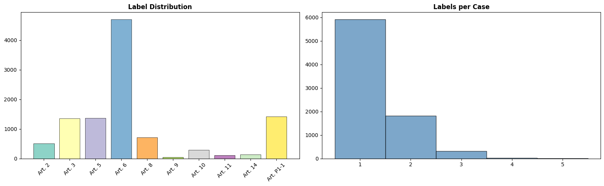

## How it works

```
Case facts ─► Text cleaning ─► Tokenizer (512 tokens) ─► Transformer encoder
                                                              │
                                                     [CLS] embedding
                                                              │
                                  Dropout ─► Linear (256) ─► ReLU ─► Dropout ─► Linear (10)
                                                              │
                                              Sigmoid ─► per-article probabilities
```

**Training setup:** AdamW (lr 2e-5, weight decay 0.01), linear warmup (10%), batch size 16, up to 5 epochs, early stopping on validation micro-F1 (patience 3), BCE loss, gradient clipping at 1.0, seed 42. Trained on a single NVIDIA T4 GPU (Google Colab).

## Results

Test set, 1,000 cases, decision threshold 0.5:

| Model | Micro-F1 | Macro-F1 | Precision | Recall | Hamming Loss ↓ | Subset Acc | ROC-AUC |
|---|---|---|---|---|---|---|---|
| BERT | 0.6631 | 0.5112 | 0.7099 | 0.6220 | 0.0689 | 0.5100 | 0.8946 |
| **RoBERTa** | **0.6808** | **0.5350** | 0.7163 | **0.6486** | 0.0663 | 0.5150 | **0.9053** |
| Legal-BERT | 0.6779 | 0.5303 | **0.7371** | 0.6275 | **0.0650** | **0.5320** | 0.8806 |

RoBERTa had the best overall F1 and ROC-AUC, while Legal-BERT had the highest precision, lowest Hamming loss and best exact-match accuracy. The gap between micro-F1 and macro-F1 shows that all three models struggle with rarer articles, which the fairness analysis below makes visible.

### Training curves
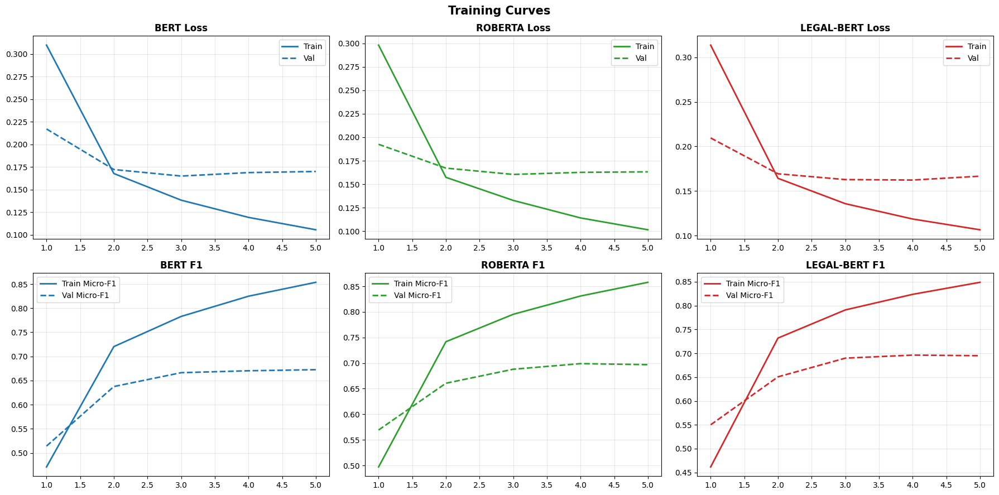

### ROC curves per article
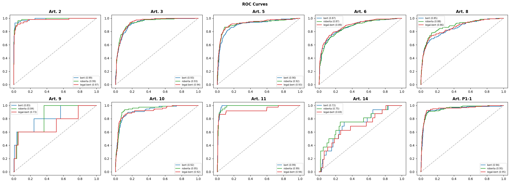

### Fairness: F1 per article
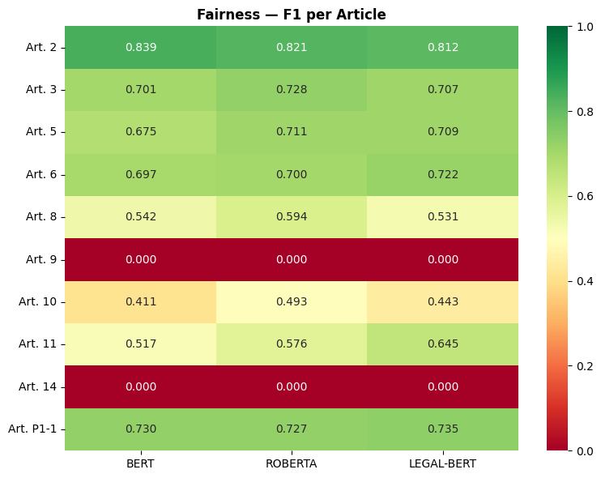

<details>
<summary>Confusion matrices</summary>

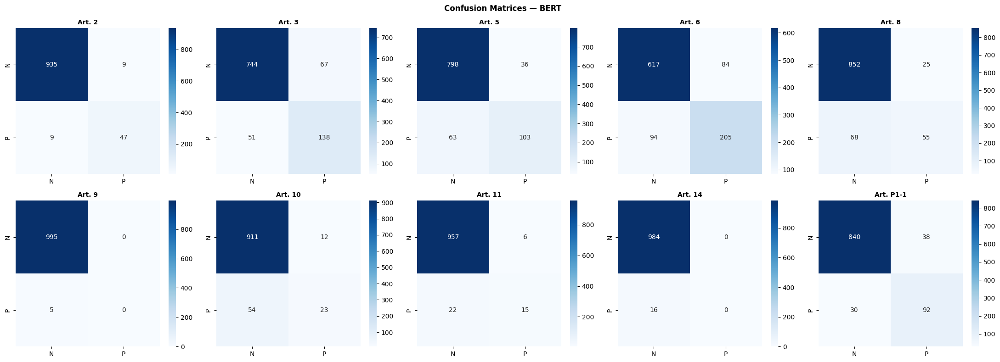
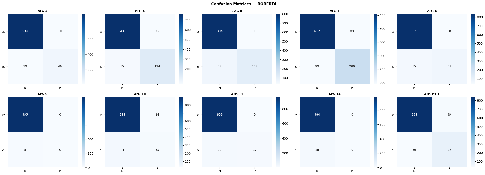
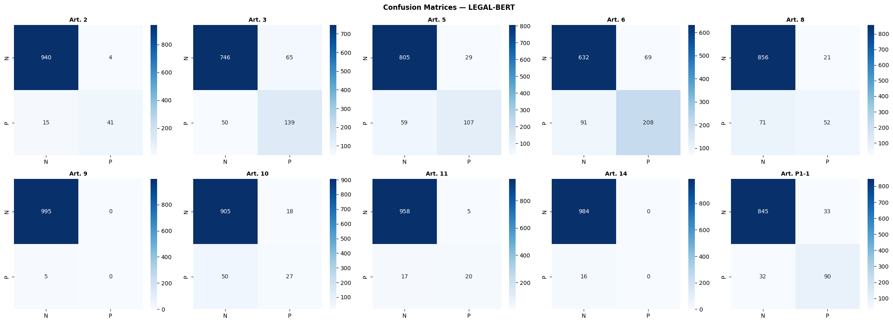

</details>

## Explainability

| Method | Type | Granularity |
|---|---|---|
| SHAP-style perturbation | Model-agnostic | Word |
| LIME | Model-agnostic | Word |
| Integrated Gradients (Captum) | Gradient-based | Token |
| Attention visualization | Model-internal | Token |
| Occlusion | Perturbation | Sentence |

| Attention | Occlusion |
|---|---|
| 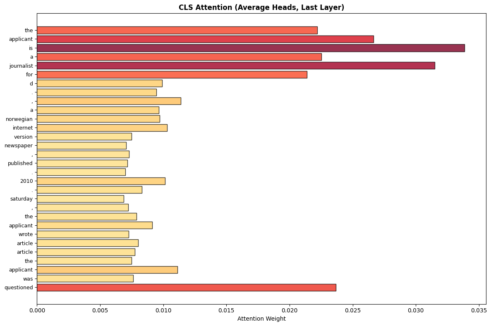 | 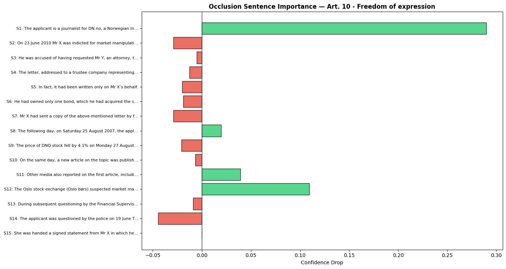 |

<details>
<summary>SHAP, LIME and Integrated Gradients</summary>

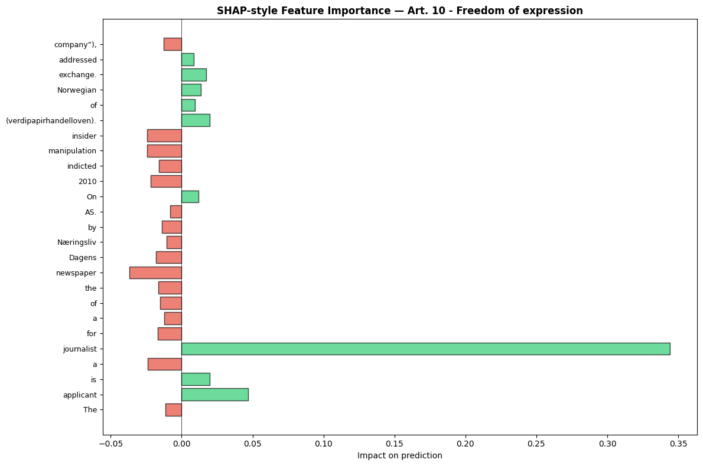
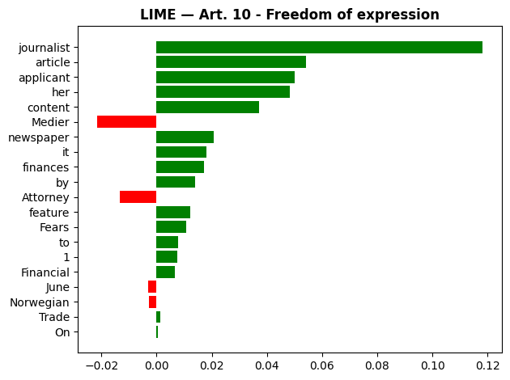
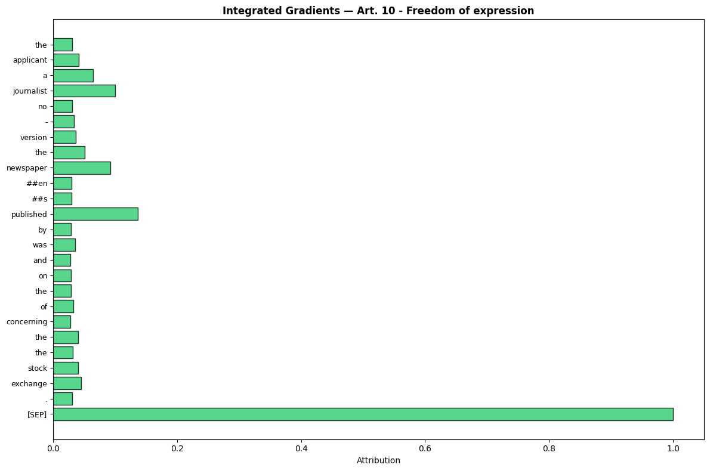

</details>

## Web app

<!-- Add screenshots of your web app here, e.g. docs/images/app_predict.png -->

| Page | What it does |
|---|---|
| Home | Project overview |
| Predict | Paste case facts, choose a model, get a verdict and per-article probabilities |
| Compare | Side-by-side model metrics |
| Explain | Attention, occlusion and word-importance views for your input |

**API endpoints**

| Method | Endpoint | Description |
|---|---|---|
| POST | `/api/predict` | Predict violations. Body: `{"text": "...", "model": "legal-bert", "threshold": 0.5}` |
| POST | `/api/explain/attention` | Token-level attention weights |
| POST | `/api/explain/occlusion` | Sentence importance |
| POST | `/api/explain/feature_importance` | Word importance (perturbation) |
| GET | `/api/comparison` | Model comparison table |
| GET | `/api/models` | Available models |

## Running it

The project runs as a single notebook in **Google Colab** with a GPU runtime.

1. Open `Jurisight.ipynb` in Colab and set **Runtime → Change runtime type → T4 GPU**.
2. Run the setup cells (install, mount Google Drive, imports, config).
3. Choose one path:
   - **Train from scratch:** run Parts 1 to 4 in order. Training all three models takes several hours on a T4.
   - **Use saved models:** run the "Load EVERYTHING from Google Drive" cell to skip training and evaluation.
4. **Web app (optional):** add your [ngrok](https://dashboard.ngrok.com) auth token in Colab's **Secrets** panel (key icon) as `NGROK_AUTH_TOKEN`, then run Part 5. The notebook prints a public URL for the app.

**Trained models:** the model checkpoints (~440 to 500 MB each) are too large for GitHub. <!-- Add a download link (Hugging Face Hub or Google Drive) here. -->

## Project structure

```
├── Jurisight.ipynb      # Full pipeline: data, training, evaluation, XAI, web app
├── requirements.txt     # Python dependencies
└── .png                 # Result plots used in this README
```

## Tech stack

Python, PyTorch, Hugging Face Transformers and Datasets, scikit-learn, SHAP, LIME, Captum, Flask, HTML/CSS/JavaScript, Google Colab, ngrok

## Limitations

- Inputs are truncated to 512 tokens, so long case descriptions lose information.
- A single 0.5 threshold is used for all articles; rare articles would likely benefit from per-article thresholds.
- Performance drops on less frequent articles (lower macro-F1).
- Predictions reflect patterns in past ECHR judgments and should not be used for real legal decisions.

## Acknowledgements

- Chalkidis et al. (2022), *LexGLUE: A Benchmark Dataset for Legal Language Understanding in English*, ACL.
- Chalkidis et al. (2020), *LEGAL-BERT: The Muppets straight out of Law School*, Findings of EMNLP.

## Author

**Lithila Ginige**, [LinkedIn](https://www.linkedin.com/in/lithiyum) · lithilamovindu@gmail.com
